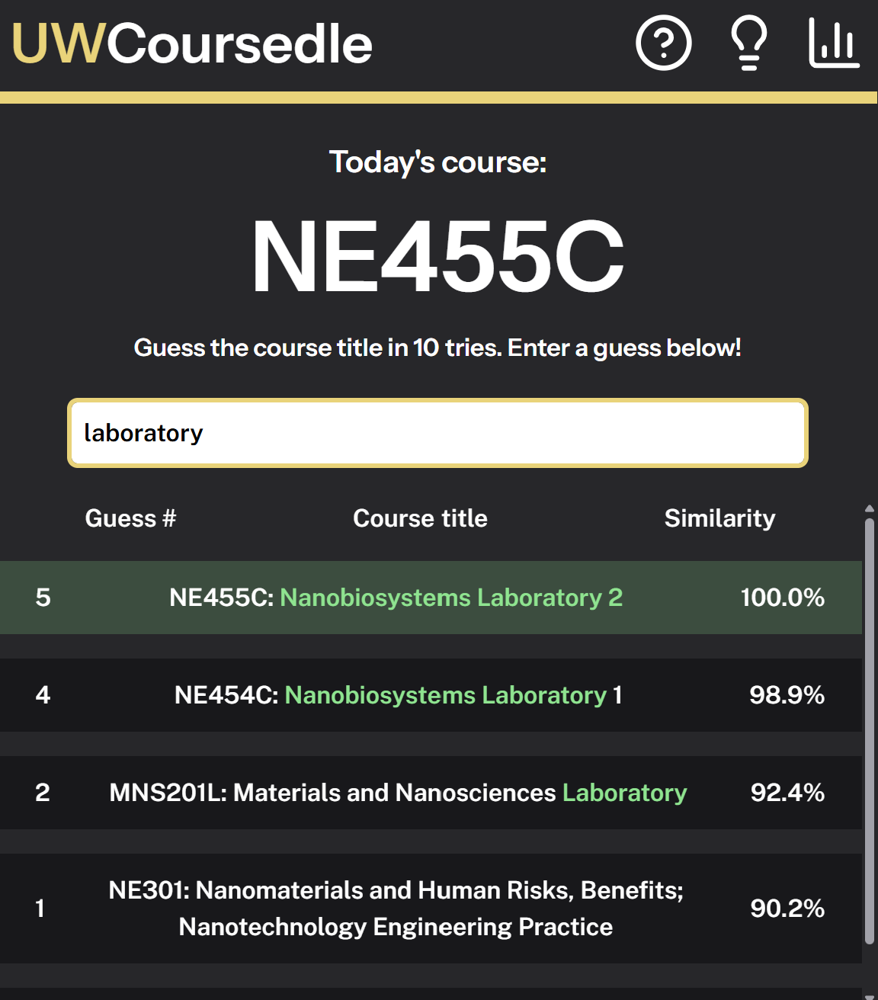

# uwcoursedle
UWCoursedle is a daily game where you goal is to guess the UWaterloo course given its course code! [Play here.](https://uwcoursedle.vercel.app/) 

Feel free to discuss suggestions, balancing, and bugs in Issues.

## How to play
Browse through course titles to search for a course to make your guess. Once you make a guess, some details about it will pop up in the list of your guesses (sorted by similarity).
 - The green text in your guess show the words with an exact match between your guess and the actual course name. 
 - The similarity score represents how semantically close the topic of the course is to your guess. 
	 - 	Due to short/imprecise descriptions of some courses, similarity scoring in them may be less accurate, but should still give a general idea
 - Hints are available by clicking the lightbulb icon on the top right of the play window and opening up the hints menu.

Have fun!
## Built with
- Svelte and Typescript frontend
- Data fetching and analysis via Python 
	- Data accessed from [UWaterloo's open API](https://uwaterloo.ca/api/)
	- Data filtering and aggregation with Pandas and Numpy
- Vector embeddings made with [sentence-transformers/all-MiniLM-L6-v2 on Huggingface](https://huggingface.co/sentence-transformers/all-MiniLM-L6-v2)

## Attributions
- Icon made by IconBaandar from [www.flaticon.com](https://www.flaticon.com/free-icon/flame_14640297)
